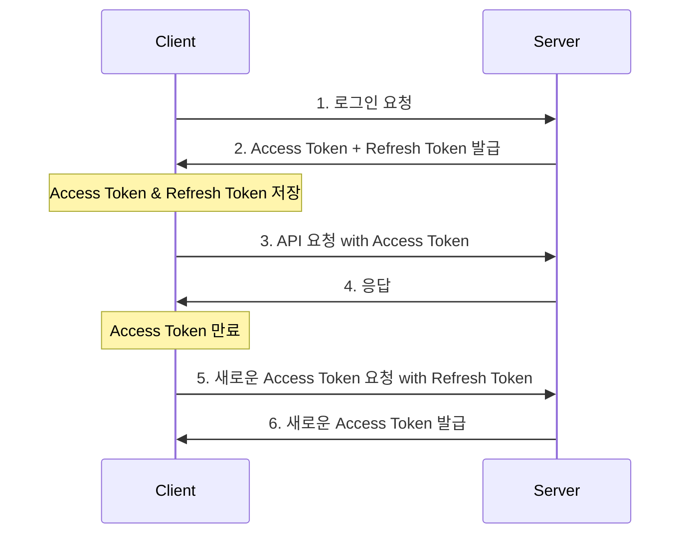

# 백엔드 개발 온보딩 과제 (Node.js)

- Jest를 이용한 테스트 코드 작성법 이해
- Express.js와 Middleware에 대한 이해
- JWT와 구체적인 알고리즘의 이해
- 리뷰 바탕으로 개선하기
- EC2에 배포해보기
- (추가)RDS를 이용한 DB 활용

## Swagger UI

- URL : [holyshin.shop/api-docs](http://holyshin.shop:3000/api-docs/)

## Express.js와 Middleware 기본 이해

[Express.js와 Middleware](docs/express-middleware.md)

## JWT 기본 이해

[JWT 기본 이해](docs/jwt-basic.md)

## 토큰 발행과 유효성 확인

[토큰 발행과 유효성 확인](docs/token-validation.md)

## 테스트 실행 방법

```bash
# 전체 테스트 실행
yarn test

# 특정 파일만 테스트
yarn test auth.test.js
yarn test jwt.test.js
yarn test middleware.test.js

# 특정 테스트 그룹만 실행
yarn test -t "회원가입 테스트"

# 테스트 커버리지 확인
yarn test:coverage
```

## 유닛 테스트 작성

[유닛 테스트 작성](docs/unit-test.md)

## 개선 사항

### Refresh Token / Access Token 개선



#### 구현 시나리오

##### 1. 로그인 시 Refresh & Access Token 발급

```javascript
// login 요청 시
const accessToken = jwt.sign(
  { username: user.username },
  jwtConfig.secret,
  { expiresIn: '1h' }, // 1시간
);

const refreshToken = jwt.sign(
  { username: user.username },
  jwtConfig.secret,
  { expiresIn: '7d' }, // 7일
);

res.json({
  accessToken,
  refreshToken,
});
```

##### 2. Refresh Token 사용 시나리오

```javascript
const refreshAccessToken = async (req, res) => {
  try {
    const { refreshToken } = req.body;

    // Refresh Token 검증
    const decoded = jwt.verify(refreshToken, jwtConfig.secret);

    // 새로운 Access Token 발급
    const newAccessToken = jwt.sign({ username: decoded.username }, jwtConfig.secret, {
      expiresIn: '1h',
    });

    res.json({ accessToken: newAccessToken });
  } catch (err) {
    res.status(401).json({ message: '토큰이 만료되었습니다.' });
  }
};
```

#### 개선 효과

- **보안 강화**: Access Token의 짧은 유효기간으로 탈취 위험 감소
- **사용자 편의성**: 잦은 로그인 없이 자동 갱신
- **시스템 효율**: 서버 부하 감소 (매 요청마다 DB 조회 불필요)
- **유연한 인증**: 토큰 기반의 확장 가능한 인증 구조
